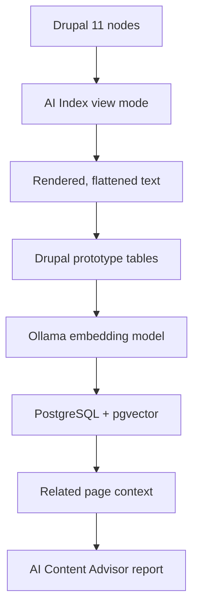

# AI editorial vector prototype

This prototype adds a "Contextual Page Check" report to AI Content Advisor. It indexes a bounded set of Drupal pages into a local pgvector database, then uses those related pages as context when an editor runs an AI Content Advisor report for a page.

## Architecture



The prototype module is `docroot/modules/custom/mass_ai_editorial`.

It adds:

- A `node.ai_index` view mode for rendering content into a canonical text representation.
- Local Drupal tables for queued documents and rendered text chunks.
- A DDEV `pgvector` service for vector search.
- Drush commands for queueing, rendering, embedding, all-organization rebuilds, stats, and search.
- A `Contextual Page Check` AI Content Advisor report type.
- A form integration that adds related pgvector context when that report type is run.

## Why this approach

- Drupal stays the source of truth. The indexed text is derived from Drupal rendering, not from a reconstructed copy of the content model.
- The `ai_index` view mode avoids manually walking nested Paragraph entities and avoids rebuilding pages through JSON:API.
- Indexing is incremental. Changed published nodes in tracked organizations are queued for reprocessing.
- The proof of concept can be bounded to Department of Unemployment Assistance content for small local tests, or rebuilt across all published organization pages with one Drush command.
- pgvector is used locally because the same general model can move to AWS Aurora PostgreSQL with pgvector later.
- Ollama is used for local embeddings so developers do not need cloud AI credentials just to populate the vector database.

## Local requirements

Install and start the normal local Drupal/DDEV stack for this repo first.

You also need Ollama running on your host machine:

```bash
brew install ollama
ollama serve
```

In another terminal, pull the embedding model:

```bash
ollama pull nomic-embed-text
```

Optional sanity check:

```bash
curl http://localhost:11434/api/tags
```

The prototype expects DDEV's web container to reach Ollama at:

```text
http://host.docker.internal:11434
```

## pgvector service

This PR adds a DDEV service at `.ddev/docker-compose.pgvector.yaml`.

From inside DDEV:

```text
host: pgvector
port: 5432
database: ai_editorial
user: ai_editorial
password: ai_editorial
```

From the host machine:

```text
host: 127.0.0.1
port: 5433
database: ai_editorial
user: ai_editorial
password: ai_editorial
```

The initial pgvector schema is in `.ddev/pgvector/init/001-ai-editorial.sql`.

It creates:

- `ai_document`
- `ai_document_chunk`
- `embedding vector(768)`
- An HNSW cosine index on chunk embeddings

The `768` dimension matches Ollama's `nomic-embed-text` model. If a different embedding model is used later, the vector column dimension and the Drush embedding command's dimension check must match that model.

Start or restart DDEV so the pgvector service is created:

```bash
ddev restart
```

Check that the container exists:

```bash
ddev describe
```

## Drupal setup

Enable the prototype module:

```bash
ddev drush en mass_ai_editorial -y
ddev drush cr
```

If the module was already enabled before the report type config was added, import the config or reinstall the module in a disposable local environment. A fresh enable installs the `Contextual Page Check` report type automatically.

AI Content Advisor still needs a chat provider configured for report generation. This prototype only uses Ollama for embeddings. The author-facing report uses the provider configured in `ai_content_advisor.configuration`, such as Claude Sonnet through the site's existing AI provider setup.

If the configured AI Content Advisor provider uses AWS Bedrock, local DDEV also needs the AWS environment variables available in the web container. Add the variable names to `.ddev/config.yaml` under `web_environment`, and use values from an approved existing environment:

```yaml
web_environment:
  - AWS_ACCESS_KEY_ID
  - AWS_SECRET_ACCESS_KEY
  - AWS_REGION=us-east-1
```

Do not commit credential values to `.ddev/config.yaml`. Keep secrets in local environment configuration or another approved local secret source.

## Populate the vector database

For a full local rebuild, run the all-organization command. It finds every published `org_page`, queues published content for each organization, renders and chunks the queued pages with the `ai_index` view mode, then generates Ollama embeddings and upserts the chunks into pgvector:

```bash
ddev drush mass-ai-editorial:index-all-orgs --reset --reset-pgvector --process-batch=100 --embed-batch=100
```

Use `--reset` to clear the Drupal-side prototype tables. Use `--reset-pgvector` when you also want to clear stale rows from the external pgvector tables before embedding. Omitting these flags makes the command additive/incremental: existing rows are upserted, and chunks that already have embeddings for the selected model are skipped.

Re-indexing a page replaces its pgvector representation rather than creating duplicate page rows. The pgvector document table is unique by Drupal entity type, entity ID, and language. Chunk rows are unique by pgvector document ID and chunk delta. When a newly rendered page has fewer chunks than a previous render, stale pgvector chunks for that page are deleted during embedding.

For a smaller local POC, you can still index only the Department of Unemployment Assistance slice used by the editorial admin search. The default organization ID is `5376`, and the default limit is `99`.

### Content type scope

The POC Drush queue command indexes published nodes for the selected organization, except for content types listed in `AiEditorialIndexer::EXCLUDED_BUNDLES`:

```text
docroot/modules/custom/mass_ai_editorial/src/AiEditorialIndexer.php
```

That exclusion list is used in three places:

- `mass-ai-editorial:queue-poc` excludes those bundles when selecting the initial organization slice.
- `mass-ai-editorial:index-all-orgs` excludes those bundles when selecting content for each published organization.
- Incremental indexing skips those bundles when a published node is saved.

Update `EXCLUDED_BUNDLES` when the POC should include or exclude additional content types. After changing the list, rebuild the local index so Drupal and pgvector reflect the new scope:

```bash
ddev drush mass-ai-editorial:index-all-orgs --reset --reset-pgvector
```

For a DUA-only rebuild after changing that list, use the smaller step-by-step commands below.

Queue the POC content and reset previous prototype rows:

```bash
ddev drush mass-ai-editorial:queue-poc --org-id=5376 --limit=99 --reset
```

Render queued nodes with the `ai_index` view mode and split the rendered text into chunks:

```bash
ddev drush mass-ai-editorial:process-queue --limit=200
```

Generate embeddings with local Ollama and upsert them into pgvector:

```bash
ddev drush mass-ai-editorial:embed-ollama --limit=250
```

Check Drupal-side indexing status:

```bash
ddev drush mass-ai-editorial:stats
```

Check pgvector status:

```bash
ddev drush mass-ai-editorial:pgvector-stats
```

For the DUA POC, a fully populated local run should show matching document, chunk, and embedded chunk counts between the Drupal-side stats and pgvector stats. The exact document and chunk counts depend on the `--limit` value, the current `EXCLUDED_BUNDLES` list, and rendered page content.

If `embed-ollama` reports that no chunks need embeddings, the vector database is already current for the rendered chunks.

### All-organization command options

The all-organization command is intended for local rebuilds that should include every published organization:

```bash
ddev drush mass-ai-editorial:index-all-orgs
```

Useful options:

| Option | Default | Meaning |
| --- | ---: | --- |
| `--org-limit` | `0` | Maximum number of published organization pages to scan. `0` means all. |
| `--content-limit` | `0` | Maximum number of content nodes to queue per organization. `0` means all. |
| `--reset` | `false` | Clear Drupal-side prototype tables before queueing. |
| `--reset-pgvector` | `false` | Clear pgvector `ai_document` and `ai_document_chunk` rows before embedding. |
| `--track` | `true` | Store the organization IDs in Drupal state so later node saves are queued incrementally. |
| `--process-batch` | `100` | Number of queued documents to render and chunk per batch. |
| `--embed-batch` | `100` | Number of chunks to embed per batch. |
| `--model` | `nomic-embed-text` | Ollama embedding model. The local pgvector schema expects 768-dimensional vectors for this model. |
| `--ollama-url` | `http://host.docker.internal:11434` | Ollama URL from inside the DDEV web container. |

For a quick smoke test against a small number of organizations:

```bash
ddev drush mass-ai-editorial:index-all-orgs --org-limit=3 --content-limit=25 --reset --reset-pgvector
```

The command de-duplicates node IDs across organizations before queueing. If one page appears under more than one organization, it is only queued once for that run.

## Test vector search directly

Run a semantic search from Drush:

```bash
ddev drush mass-ai-editorial:search "weekly unemployment claim" --limit=5
```

Another useful test:

```bash
ddev drush mass-ai-editorial:search "overpayment waiver" --limit=5
```

The command prints the similarity score, node ID, chunk number, title, and URL for nearby chunks.

## Test the Content Advisor report

Open a page in the indexed slice, for example:

```text
https://mass.local/how-to/file-your-weekly-unemployment-claim/content-advisor
```

Choose:

```text
Contextual Page Check
```

Then click:

```text
Analyze
```

The report should use:

- The current page's rendered `ai_index` text.
- Related pages from pgvector.
- Breadcrumb text.
- Indexed context for the immediate breadcrumb parent, when that parent page is in the local index.
- Indexed context for a small set of internal pages linked from the current page's main body area.
- Semantic heading markers such as `Heading level 2: Apply online`.
- Link targets preserved as `[href: ...]`.
- "Offered by" links from the rendered view mode.
- Incoming links from Entity Usage.

The prompt is tuned to show only actionable editorial suggestions. It should omit related pages that require no action and omit suggested links that are already linked.

## Link normalization

The flattened text keeps hyperlink targets so the report can tell what the page already links to. Internal Mass.gov links are normalized to root-relative paths before they are written to the index:

```text
https://www.mass.gov/how-to/file-your-weekly-unemployment-claim
https://mass.gov/how-to/file-your-weekly-unemployment-claim
https://mass.local/how-to/file-your-weekly-unemployment-claim
```

All become:

```text
/how-to/file-your-weekly-unemployment-claim
```

This avoids confusing the chat model with a mix of production hostnames, local hostnames, and root-relative links that all point to the same site path. External URLs are left unchanged.

If link normalization logic changes, re-render and re-embed the indexed content. For a full local rebuild:

```bash
ddev drush mass-ai-editorial:index-all-orgs --reset --reset-pgvector
```

For a DUA-only rebuild:

```bash
ddev drush mass-ai-editorial:queue-poc --org-id=5376 --limit=99 --reset
ddev drush mass-ai-editorial:process-queue --limit=200
ddev drush mass-ai-editorial:embed-ollama --limit=250
```

## Chunking behavior

Rendered headings are preserved in the flattened text as semantic markers, for example:

```text
Heading level 2: Apply online
```

The chunker uses those heading markers as section boundaries. It tries to keep complete sections together up to a 650-word target size. If a section is too long, it falls back to overlapping word windows for that section only. Neighboring chunks keep a small overlap so the beginning of a section is not isolated from the end of the previous section.

## Related-page context limits

The Content Advisor report does not send every indexed page to the chat model. It first appends dedicated context for the immediate breadcrumb parent when that page is present in the local index. It also appends context for a small set of internal pages linked from the current page's main body area. It then asks pgvector for pages that are semantically close to the current page and appends a bounded amount of that related-page context to the prompt.

The breadcrumb parent is handled separately from vector-related pages because the parent is structurally important even when it is not one of the closest semantic matches. Its indexed text is included as `Breadcrumb parent page context`, with an 8,000-character safety cap for unusually long parent pages, and is omitted from the later related-page list to avoid duplicate context.

Body-linked pages are also handled separately because an author chose to link them from the main body of the page. If the current page has six or fewer internal page links in the main body, the indexed context for those linked pages is included as `Body-linked page context`, with a 3,000-character safety cap per linked page. Breadcrumb links, incoming-link summaries, table-of-contents anchors, contact links, downloads, and related-links sections are excluded from this body-link context. Body-linked pages are omitted from the later vector-related list to avoid duplicate context.

The current limits are adaptive. They are calculated in `mass_ai_editorial_contextual_page_check_context_limits()` in `docroot/modules/custom/mass_ai_editorial/mass_ai_editorial.module`.

The default is five related pages and up to three matching chunks from each related page. Pages with more incoming or outgoing links get a wider comparison set:

| Page signal | Related pages | Max chunks per page |
| --- | ---: | ---: |
| Default page | 5 | 3 |
| 15 or more outgoing links, or 15 or more incoming links | 8 | 3 |
| 40 or more combined incoming and outgoing links | 10 | 3 |
| 60 or more combined links, 40 or more incoming links, or 40 or more outgoing links | 12 | 3 |

Outgoing links are counted from the flattened indexed text. Breadcrumb links and incoming-link summary links are excluded from the outgoing count. Incoming links come from Entity Usage when available, with a fallback to the indexed incoming-link summary.

This limit only affects what the chat model sees during one report run. It does not change which pages are indexed or embedded in pgvector.

Chunk inclusion is adaptive. The best-matching chunk for each related page is always included. A second chunk is included only when its similarity score is within about `0.04` of the best chunk. A third chunk is included only when its similarity score is within about `0.06` of the best chunk. This gives the model more context when several sections of a related page are similarly relevant, while keeping single-section matches compact.

To make the report compare against more or fewer pages, adjust the thresholds or assigned `$page_limit` values in `mass_ai_editorial_contextual_page_check_context_limits()`:

```php
if ($outgoing_links >= 15 || $incoming_links >= 15) {
  $page_limit = 8;
}
```

The helper returns the page limit and max chunks-per-page limit:

```php
return [$page_limit, 3];
```

To allow more or less evidence from each related page, change the second returned value. For example, `return [$page_limit, 2];` allows up to two matching chunks per related page.

Higher values can improve recall, but they also make reports slower, noisier, and more likely to hit provider token limits. For the local POC, a max of three adaptive chunks per related page is a reasonable default because it captures multi-section matches without automatically sending three chunks for every related page.

## Incremental indexing behavior

When a published node changes, `mass_ai_editorial` queues it if it belongs to an organization tracked in Drupal state:

```text
mass_ai_editorial.tracked_org_ids
```

The `index-all-orgs` command tracks all indexed organizations by default. The `queue-poc` command tracks the selected organization by default, which is useful for DUA-only testing.

After changing a page, run:

```bash
ddev drush mass-ai-editorial:process-queue --limit=25
ddev drush mass-ai-editorial:embed-ollama --limit=100
```

Only queued and changed content should need rendering and embedding.

## Troubleshooting

If pgvector tables do not exist, make sure DDEV was restarted after adding `.ddev/docker-compose.pgvector.yaml`:

```bash
ddev restart
```

If a full refresh fails with a MySQL `Incorrect string value` error while inserting `mass_ai_editorial_chunk.text`, the rendered page likely contains malformed UTF-8 bytes. Valid non-English characters should be preserved. The text extractor and repository defensively remove malformed byte sequences before storing flattened text, chunks, or embeddings.

If the pgvector database was created before the init SQL existed, the init file will not run automatically against the existing Docker volume. In a disposable local environment, recreate the DDEV service volume, then restart DDEV.

If embeddings fail, verify Ollama is running on the host:

```bash
curl http://localhost:11434/api/tags
```

If DDEV cannot reach Ollama, confirm the embedding command is using:

```text
--ollama-url=http://host.docker.internal:11434
```

If the Content Advisor report fails but embeddings work, check the site's configured AI Content Advisor provider. Ollama is not currently used for the report text; it is only used to generate embeddings.

If the report has no related page context, check both status commands:

```bash
ddev drush mass-ai-editorial:stats
ddev drush mass-ai-editorial:pgvector-stats
```

## Useful command reference

```bash
ddev drush mass-ai-editorial:index-all-orgs --reset --reset-pgvector
ddev drush mass-ai-editorial:queue-poc --org-id=5376 --limit=99 --reset
ddev drush mass-ai-editorial:process-queue --limit=200
ddev drush mass-ai-editorial:embed-ollama --limit=250
ddev drush mass-ai-editorial:stats
ddev drush mass-ai-editorial:pgvector-stats
ddev drush mass-ai-editorial:search "weekly unemployment claim" --limit=5
```
