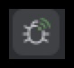

# Drupal Twig Debugging

## Locating Template files

1. Copy the `docroot/sites/default/example.services.local.yml` file to `docroot/sites/default/services.local.yml`.
2. Clear the cache by running `ddev drush cr`.
3. Inspect the rendered page in a browser.
4. You should see HTML comments indicating what templates are being used throughout the source code. See [Drupal.org: Locating Template Files with Debugging](https://www.drupal.org/node/2358785)

## Quickest Debug for Twig Templates: Twig Tweak Drupal Dump

* Add `{{ drupal_dump() }}`, `{{ drupal_dump(variable-name) }}` or `{{ dd() }}` or `{{ dd(variable-name) }}` to a Twig template file and refresh the browser with mass.local. See [Drupal.org: Twig Tweak Cheat sheet (Drupal Dump)](https://www.drupal.org/docs/contributed-modules/twig-tweak-2x/cheat-sheet#s-drupal-dump)
* You can add this multiple times to the same or different template files.

> Remember to remove all calls to `drupal_dump()` or `dd()` from templates before committing.

## PHP Debug with Xdebug and PhpStorm

### Initial setup:
1. [Set up Xdebug in PhpStorm](https://www.jetbrains.com/help/phpstorm/configuring-xdebug.html).
2. Enable Xdebug in ddev by running `ddev xdebug on`.  See [DDEV PHP Step Debugging](https://ddev.readthedocs.io/en/stable/users/step-debugging/) for ddev specific setup instructions and how to configure your IDE.
3. Download and enable the [Xdebug helper](https://www.jetbrains.com/help/phpstorm/browser-debugging-extensions.html) browser extension.

### Drupal PhpStorm integration:
1. In PhpStorm, under Preferences > PHP > Frameworks:
   - Check off `Enable Drupal integration`
   - Set `Drupal installation path` to `[you_local_path_to_openmass_parent_folder]/openmass/docroot`
   - Select version `9`
2. In PhpStorm, under Preferences > PHP > Servers, set `Absolute path on the server` to `/var/www/html` for openmass.
3. Edit debug configurations:
   - 
   - Click on the "+" sign to add new configuration and choose `PHP Web Page`
   - Set server to `mass.local` in your config. 
  

For more information, refer to [PHP frameworks and external tools/Drupal](https://www.jetbrains.com/help/phpstorm/drupal-support.html)

### Starting a debugging session:
1. Enable the Devel module by running `ddev drush en devel`.
2. Clear the cache by running `ddev drush cr`.
3. Enable Xdebug listening in PhpStorm.
   
4. Enable `Debug` in the Xdebug helper browser extension for the page you are debugging.
5. Set a breakpoint by clicking to the right of a line number.
   
6. Refresh mass.local in the browser to hit the breakpoint.
   1. You may need to clear the cache as you make changes to the template file.

### For Twig debugging, follow these additional steps:
0. Comment out `cache: false` in `docroot/sites/default/services.local.yml`.
0. Clear the cache by running `ddev drush cr`, and make sure openmass/docroot/sites/default/files/php/twig folder exists.
0. In PhpStorm, under Preferences > PHP > Debug > Templates > Twig Debug, set the Cache path to `[you_local_path_to_openmass_parent_folder]/openmass/docroot/sites/default/files/php/twig`, or use the file locator to point to that folder.
0. Set a breakpoint by clicking to the right of a line number.

> Please note: this method is not working consistently. Refer to the quickest debug method for Twig template logging for now. If you can get this the Twig debug working consistently with Xdebug, please suggest changes to these steps. 

**Note: Don't commit changes to the `core.extension` file enabling the `devel` module, or `devel` related config files.**

## Additional Resources

### Twig debugging

* [Drupal.org: Debugging Twig templates](https://www.drupal.org/docs/theming-drupal/twig-in-drupal/debugging-twig-templates)

### Viewing variables

* [Drupal.org: Debugging Twig tempaltes (Viewing variables)](https://www.drupal.org/docs/theming-drupal/twig-in-drupal/debugging-twig-templates#s-viewing-variables)
