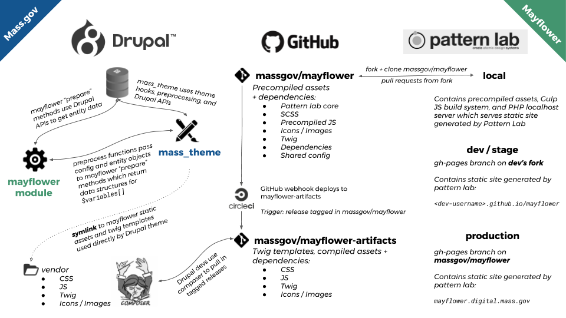

# Mayflower

[Mayflower](https://github.com/massgov/mayflower) is an opensource design system for the state government of Massachussets. It contains a [PatternLab (Twig)](http://patternlab.io/) component library that's used as a frontend dependency for Mass.gov (Openmass).

## Mayflower and Mass.gov's Drupal theme

Openmass has a custom Drupal theme called [mass_theme](../docroot/themes/custom/mass_theme), which uses Mayflower build artifacts as a project dependency for static assets (css, js, and image) as well as twig templates.

This relationship is managed alongside other project dependencies through composer. Learn more about this relationship in the [Mayflower Artifacts](#mayflower-artifacts) section below.

Mass.gov also uses a custom Drupal module, called [mayflower](../docroot/modules/custom/mayflower), which acts as "glue code" to get `mass_theme` working with Mayflower. Learn more in the [mass_theme](../docroot/themes/custom/mass_theme) and [mayflower module](../docroot/modules/custom/mayflower).

### A visual flow from Mayflower to Drupal

[](https://docs.google.com/presentation/d/1qWY-QoXu8JgazqnwNUoPyumu_XH-DgFj_iNoFiKu1YA/edit#slide=id.p)

## Mayflower Artifacts

[Mayflower Artifacts](https://github.com/massgov/mayflower-artifacts) is a repository containing versioned build artifacts of Mayflower Patternlab. All branches and tags from Mayflower are deployed automatically via CircleCI to Mayflower Artifacts.

Openmass can point to a specific version of Mayflower Artifacts built from a Mayflower branch (e.g. `patternlab/DP-1234`) by pointing to a branch alias prefixed by `dev-` (e.g. `dev-patternlab/DP-1234`) using composer. 

### Mayflower integration by default and in production
By default, The Openmass `develop` branch and `master` branch always point to the `develop` branch of Mayflower. 
```
// In composer.json
"massgov/mayflower-artifacts": "dev-develop"
```
If a new change has been merged into the `develop` branch of Mayflower, running `composer require massgov/mayflower-artifacts:dev-develop --update-with-dependencies` in openmass will bring in the latest change from Mayflower and update the composer.lock in openmass to "lock" to the specifc version.

### Mayflower integration for feature development and testing

#### Local Development Workflow
If you're working on a ticket that requires Mayflower changes that you want to preview locally before committing, you can link to a locally-built version of Mayflower artifacts

1. Clone [massgov/mayflower](https://github.com/massgov/mayflower) and follow the [setup instructions](https://github.com/massgov/mayflower#getting-started-on-development).
2. Inside your local Mayflower installation, copy `packages/patternlab/styleguide/.env.example` to `packages/patternlab/styleguide/.env`, and set the `MAYFLOWER_DIST` environment variable so it points at `libraries/mayflower-dev` in your Drupal root (eg: `MAYFLOWER_DIST=~/Sites/openmass/docroot/libraries/mayflower-dev`).
3. Build the artifacts from Mayflower Patternlab by running `rush build:patternlab`.
4. Check to see if the mayflower artifacts generated from the previous step exists in the your local openmass repo at openmass/docroot/libraries/mayflower-dev
5. Run `ahoy drush cr` on the Drupal site to have the development artifacts picked up.

> Note that you might want to remove the `mayflower-dev` folder when you are finished development, since it will override whatever version of Mayflower is otherwise specified.


#### Using a branch of mayflower-artifacts in your Drupal branch:
If you're working on a ticket that requires Mayflower changes and the Mayflower PR hasn't been merged into develop, you can _temporarily_ pull in a remote feature branch of mayflower-artifacts to Drupal for testing.

1. From your terminal, within Docker, update and download your new mayflower version by running 
```composer require massgov/mayflower-artifacts:dev-<your-mayflower-branch-name> --update-with-dependencies```
> For example, if your Mayflower branch name is `DP-8411-test-branch`, after the branch has been deployed by circleCI, you can run `composer require massgov/mayflower-artifacts:dev-DP-8411-test-branch --update-with-dependencies` in openmass to pull it in.
1. Commit the composer.json and composer.lock changes which correspond to updating mayflower-artifacts
1. You should now have Mayflower updated in your feature branch. Remember to rebuild your cache!
1. To deploy the Mayflower changes in openmass to a feature environment for external review, you just push your composer commit to Github
    1. Tugboat will automatically build your branch with the mayflower artifacts version that you specified (Note: you will need to resolve any conflicts on the branch with develop or the deployment will fail)
    2. To deploy to an Acquia feature environment, run `drush ma:deploy <feature-environment> <your-openmass-branch-name>` inside the SSH shell. 

If you have committed your change to point to a feature branch of mayflower artifacts instead of the develop branch, make sure you change it back to point to `dev-develop` before merging into develop. 

#### Merging a feature PR with Mayflower changes:
Please make sure you check the [Mayflower integration peer review checklist](./peer_review_checklist.md#mayflower-integration) before squashing and merging a feature PR into develop. 