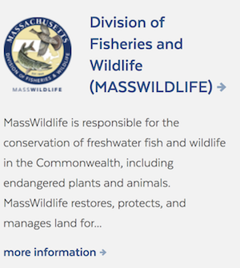

# Search and Structured Data
Guidelines around adding structured metadata to your website for search engine
optimization and seamless consumption in the Commonwealth's search application
(search.mass.gov).

## Metatag Dictionary

Below is a dictionary describing the metatag standards implemented in mass.gov web page content and consumed in the Commonwealth's search application, [search.mass.gov](https://search.mass.gov).

### Descriptions

| **Metatag** | **Description** |
| :--- | :--- |
| mg\_organization | One or more entities responsible for making the resource available such as a publishing house, a government agency or department, or a corporate entity. |
| category | A classification scheme that categorizes content into context specific groupings. The available options for this field are from a controlled vocabulary managed by the digital services team. Refer to the [controlled vocabulary for category](search-and-structured-data.md#category-vocabulary). |
| mg\_date | A point in time  associated with the resource. |
| mg\_type | A very specific classification scheme that categorizes content into context specific types. The available options for this field are from a controlled vocabulary managed by the digital services team.  Refer to the [mg\_type controlled vocabulary](search-and-structured-data.md#mg_type-vocabulary). |
| mg\_phone\_number | The main phone number for contacting a specific entity. |
| mg\_contact\_details | Contact details related to the main phone number such as hours of operation. |
| mg\_location\_listing\_url | An object containing the name and url to access a list of locations for an entity. |
| mg\_online\_contact\_url | An object containing the name and email/url  for contacting the entity. |
| mg\_key\_actions | An object indicating the key actions related to a government service page. |

### Syntax and Examples

In order for the above metatags to be consumed and leveraged consistently in the search application, each metatag has a required syntax. Follow the syntax guidelines precisely for your content to show up as desired in search.mass.gov.

| **Metatag** | **Syntax** | **Example** |
| :--- | :--- | :--- |
| mg\_organization | lowercase, comma separated list, slug with no special characters or spaces, one or more values. As `-` makes a single organization multiple tokens and the [google search api only allows us to filter on up to 10 tokens](https://developers.google.com/custom-search/docs/structured_search), it is prefered to not include `-` in values. | `department-of-public-health,department-of-mental-health` or `departmentofpublichealth,departmentofmentalhealth` |
| category | lowercase, controlled vocabulary, one value only, slug with no special characters | `news` |
| mg\_date | YYYYMMDD | `20180528` |
| mg\_type | lowercase, controlled vocabulary, one value only, slug with no special characters | `executive-order` |
| mg\_phone\_number | XXX-XXX-XXXX | `617-557-1000` |
| mg\_contact\_details | string | `Hours: Mon. - Fri., 8:30 a.m. - 4:30 p.m.` |
| mg\_location\_listing\_url | structure object with schema:  \[{ "name": "Example",  "url": "[https://example.gov](https://example.gov)" }\] | `[{ "name": "Massachusetts Supreme Judicial Court Locations", "url": "https:\/\/www.mass.gov\/orgs\/massachusetts-supreme-judicial-court\/locations" }]` |
| mg\_online\_contact\_url | structured object with schema: \[{ "name": "email@mass.gov", "url": email@mass.gov" }\] | `[{ "name": "engineerboard@state.ma.us", "url": "engineerboard@state.ma.us" }]` |
| mg\_key\_actions | structured object with schema: \[{ "name": "key action 1", "url": "[https://mass.gov/keyaction1](https://mass.gov/keyaction1)" }\] | `[{ "name": "Compare plans at MassHealthChoices.com", "url": "https:\/\/masshealthchoices.com\/"},{"name": "Enroll in a health plan", "url": "https:\/\/www.mass.gov\/how-to\/enroll-in-a-masshealth-health-plan-individuals-and-families-younger-than-65" }]` |

### Controlled Vocabularies

Controlled vocabularies provide a way to organize knowledge for subsequent retrieval. Controlled vocabulary schemes mandate the use of predefined, authorised terms that have been preselected by the designers of the schemes. The vocabularies below are maintained by the digital services team. If you would like to include an additional term in a vocabulary for use in the search application, please contact the digital services team.

#### category vocabulary

| **Vocabulary** |
| :--- |
| news, laws-regulations, services, state-organizations, data |

#### mg\_type vocabulary

| **Category** | **Vocabulary** |
| :--- | :--- |
| news | press-release, press-statement, news, speech |
| laws-regulations | general-law, session-law, executive-order, regulation, advisory, policy-advisory, policy-statement, administrative-bulletin, technical-information-release, directive, letter-ruling, memorandum, industry-letter, circular-letter, regulatory-bulletin, administrative-procedure, advisory-ruling, decision, ruling, opinion, settlement, consent-order, cease-directive, cease-order, consent-agreement, temporary-order-to-cease-and-desist, order, temporary-order, rules-of-civil-procedure, rules-of-criminal-procedure, rules-of-appellate-procedure, districtmunicipal-courts-supplemental-rules-of-civil-procedure, rules-of-domestic-relations-procedure, districtmunicipal-courts-supplemental-rules-of-criminal-procedure, trial-court-rules, superior-court-rules, supreme-judicial-court-rules, appeals-court-rules, districtmunicipal-court-rules, probate-and-family-court-rules, housing-court-rules, juvenile-court-rules, land-court-rules, guide-to-evidence, electronic-filing-rules, professional-conduct-rules, districtmunicipal-courts-rules-for-probation-violation-proceedings, special-rules-of-the-district-court, probate-and-family-court-uniform-practices, supplemental-rules-of-the-probate-and-family-court, rules-governing-persons-authorized-to-admit-to-bail-out-of-court, districtmunicipal-courts-rules-of-criminal-procedure, office-of-jury-commissioner-regulations, districtmunicipal-courts-rules-for-appellate-division-appeals, law-library |

### Integration with Search.Mass.Gov

Below is a summary of how each metatag is used in [search.mass.gov](https://search.mass.gov) including its role in [advanced search filters](search-and-structured-data.md#advanced-search-filters), [sorting](search-and-structured-data.md#sort), and [rendering of search results](search-and-structured-data.md#search-result-teasers). To see these metatags in action, browse search.mass.gov - testing out its functionality.

#### Advanced Search Filters

| **Metatag** | **Filter Functionality** | **Example** |
| :--- | :--- | :--- |
| mg\_organization | Controls the ability to filter content by organization on search.mass.gov. |  |
| category | Controls if content is rendered within a specific tab in the search application. |  |
| mg\_date | Powers the advanced search filter that allows users to restrict their search results to a specific date range. |  |
| mg\_type | Powers the advanced search filter that allows users to restrict their search results to a specific type of content. |  |

#### Sort

| **Metatag** | **Sort Functionality** | **Example** |
| :--- | :--- | :--- |
| mg\_date | Used when sorting by date on the "news" and "laws-regulations" tabs. |  |

#### Search Result Teasers

| **Metatag** | **Teaser Functionality** | **Example** |
| :--- | :--- | :--- |
| mg\_organization | Rendered for content in the category news and laws-regulations. |  |
| mg\_date | Rendered for content categorized as "laws-regulations"  and "news". |  |
| mg\_type | Rendered for content categorized as "laws-regulations"  and "news". |  |
| mg\_phone\_number | Rendered in teaser for content categorized as "state-organizations" |  |
| mg\_contact\_details | Rendered in teaser for content categorized as "state-organizations" |  |
| mg\_location\_listing\_url | Rendered in teaser for content categorized as "state-organizations" |  |
| mg\_online\_contact\_url | Rendered in teaser for content categorized as "state-organizations" |  |
| mg\_key\_actions | Rendered in teaser for content categorized as "state-organizations" or "services" |  |

## Adding Structured Metatags to your Website

There are two options for including structured markup in your website for consumption in the [search.mass.gov](https://search.mass.gov) application \(1\) adding page level metatags into the header of each page and \(2\) adding structured xml markup to your sitemap.

### Page Level Metatags

You can include metadata in the HTML of your pages, specifically in the `<head>` of your pages. Below, you can view an example html page that includes metatags in the head of the content.

```text
<!DOCTYPE html>
<html lang="en" dir="ltr" xmlns:dc="http://purl.org/dc/terms/" xmlns:og="http://ogp.me/ns#" xmlns:article="http://ogp.me/ns/article#" xmlns:book="http://ogp.me/ns/book#" xmlns:product="http://ogp.me/ns/product#" xmlns:profile="http://ogp.me/ns/profile#" xmlns:video="http://ogp.me/ns/video#" >
  <head>
    <link rel="canonical" href="https://mass.gov/example-one"/>
    <meta name="title" content="Example Page" />
    <meta property="og:site_name" content="Mass.Gov" />
    <meta name="MobileOptimized" content="width" />
    <meta name="HandheldFriendly" content="true" />
    <meta name="viewport" content="width=device-width, initial-scale=1.0" />
    <link rel="stylesheet" href="https://mayflower.digital.mass.gov/patternlab/css/base-theme-generated.css">
    <link rel="stylesheet" href="https://mayflower.digital.mass.gov/patternlab/css/index-generated.css">
    <title>Example One Page</title>
    <meta property="og:title" content="Example One Page">
    <meta name="mg_online_contact_url" content="[{"name":"example@sao.state.ma.us","url":"example@sao.state.ma.us"},{"name":"Subscribe to our Enewsletter","url":"http:\/\/example.com\/bL-SjD"},{"name":"Request that Elected Official Speak to Your Group or Event","url":"https:\/\/www.mass.gov\/how-to\/request-that-official-speak-to-your-group-or-event"}]">
    <meta name="mg_phone_number" content="617-123-4567">
    <meta name="mg_contact_details" content="Open M-F 8am-5pm">
    <meta name="mg_location_listing_url" content="[{"name":"Example Locations","url":"https:\/\/www.mass.gov\/orgs\/example\/locations"}]">
  </head>
  <body>
    <h1>Example Metatag in Header of Page</h1>
    <p>Refer to the head tag in the html for example contents.</p>
  </body>
</html>
```

### Sitemap Level Metatags

If you don't want to include PageMap data in the HTML of your pages, you can add PageMap data to a Sitemap. In order for these to be discoverable by search.mass.gov, submit your sitemap via the Google Search Console Sitemaps tool. One benefit of leveraging the sitemap option, is that you can include metatags for not html content such as pdfs or documents. Below, you can view an example sitemap including pagemap metatags.

```text
<?xml version="1.0" encoding="UTF-8"?>
<urlset xmlns="http://www.sitemaps.org/schemas/sitemap/0.9">
   <url>
      <loc>https:///mass.gov/page/example-one</loc>
      <lastmod>2018-06-16T01:38Z</lastmod>
      <changefreq>weekly</changefreq>
      <PageMap xmlns="http://www.google.com/schemas/sitemap-pagemap/1.0">
         <DataObject type="metatags">
            <Attribute name="mg_organization">department-of-environmental-protection,department-of-conservation-and-recreation</Attribute>
            <Attribute name="mg_date">20180530</Attribute>
            <Attribute name="category">laws-regulations</Attribute>
            <Attribute name="mg_type">regulation</Attribute>
         </DataObject>
      </PageMap>
   </url>
   <url>
      <loc>https://mass.gov/page/example-two.pdf</loc>
      <lastmod>2018-06-16T01:38Z</lastmod>
      <changefreq>daily</changefreq>
      <PageMap xmlns="http://www.google.com/schemas/sitemap-pagemap/1.0">
         <DataObject type="metatags">
            <Attribute name="mg_organization">department-of-public-health,department-of-mental-health</Attribute>
            <Attribute name="mg_date">20180430</Attribute>
            <Attribute name="category">news</Attribute>
            <Attribute name="mg_type">press-release</Attribute>
         </DataObject>
      </PageMap>
   </url>
</urlset>
```

## Including your Website in Search.Mass.Gov

### Adding your Domain to the Search.Mass.Gov CSE

Currently, the Google Custom Search Engine \(CSE\) powering search.mass.gov indexes over 60 Commonwealth web properties. A [complete list of these web properties](search-and-structured-data.md#websites-included-in-search-mass-gov) is included in a table below. If you believe your website should be included in the results set returned on search.mass.gov, please contact the search team by submitting a [Github issue to Mayflower](https://github.com/massgov/mayflower/issues) labelled `add domain to search` .

#### Websites Included in Search.Mass.Gov

| **Website & Description** | **Domain** | **URL Patterns included in Search** |
| :--- | :--- | :--- |
| Barnstable County Sheriff's Department | bsheriff.net | [www.bsheriff.net](http://www.bsheriff.net/) |
| Berkshire County Sheriff's Department | bcsoma.org | [bcsoma.org](https://bcsoma.org/) |
| Bershire Regional Planning Commission | berkshireplanning.org | [www.berkshireplanning.org](http://berkshireplanning.org/) |
| Boston Region Metropolitan Planning Organization | ctps.org | [www.ctps.org](https://www.ctps.org/) |
| Bristol County District Attorney | bristolda.com | [bristolda.com](http://bristolda.com/) |
| Center for Health Information and Analysis | chiamass.gov | [www.chiamass.gov](http://www.chiamass.gov/) |
| Civil Service Eligible Lists | csexam.hrd.state.ma.us | [www.csexam.hrd.state.ma.us/ eligiblelist/eligiblelist.aspx](https://www.csexam.hrd.state.ma.us/eligiblelist/eligiblelist.aspx) |
| Committee for Public Counsel Services \(Public Defender Agency of Massachusetts\) | publiccounsel.net | [www.publiccounsel.net](https://www.publiccounsel.net/) |
| Commonwealth Corporation | commcorp.org | [www.commcorp.org](http://commcorp.org/) |
| Commonwealth of Massachusetts Supreme Judicial Court Mental Health Legal Advisors Committee | mhlac.org | [www.mhlac.org](http://mhlac.org/) |
| Community Economic Development Assistance Corporation | cedac.org | [www.cedac.org](https://cedac.org/) |
| Dukes County | dukescounty.org | [www.dukescounty.org](http://www.dukescounty.org/Pages/index) |
| Massachusetts Empowering Small Business | empoweringsmallbusiness.org | [www.empoweringsmallbusiness.org](https://www.empoweringsmallbusiness.org/) |
| Franklin County Sheriff's Department | fcso-ma.us | [www.fcso-ma.us](https://www.fcso-ma.us/) |
| Hampden County Sheriff's Department | hcsdmass.org | [www.hcsdmass.org](http://www.hcsdmass.org/) |
| Hampden District Attorney | hampdenda.com | [www.hampdenda.com](http://hampdenda.com/) |
| Hampshire County Sheriff's Department | hampshiresheriffs.com | [www.hampshiresheriffs.com](http://www.hampshiresheriffs.com/) |
| Massachusetts Registry of Motor Vehicles | massrmv.com & secure.rmv.state.ma.us | [www.massrmv.com](http://www.massrmv.com/) & [secure.rmv.state.ma.us](https://secure.rmv.state.ma.us/) |
| Mass.Gov | mass.gov | [www.mass.gov](https://www.mass.gov/) |
| Massachusetts Board of Library Commissioners | mblc.state.ma.us | [mblc.state.ma.us](http://mblc.state.ma.us/) |
| Massachusetts Cases | masscases.com | [masscases.com](http://masscases.com/) |
| Massachusetts Compare Care | masscomparecare.gov | [www.masscomparecare.gov](https://www.masscomparecare.gov/) |
| Massachusetts Comptroller | macomptroller.org | [www.macomptroller.org](https://www.macomptroller.org/) |
| Massachusetts Cultural Council | massculturalcouncil.org | [massculturalcouncil.org](https://massculturalcouncil.org/) |
| Massachusetts Department of Early and Secondary Education | doe.mass.edu | [www.doe.mass.edu](http://www.doe.mass.edu/) |
| Massachusetts Department of Higher Education | mass.edu | [www.mass.edu](https://www.mass.edu/) |
| Massachusetts Educational Financing Authority | mefa.org | [www.mefa.org](https://www.mefa.org/) |
| Massachusetts Environmental Public Health Tracking | matracking.ehs.state.ma.us | [matracking.ehs.state.ma.us](https://matracking.ehs.state.ma.us/) |
| Massachusetts Gaming Commission | massgaming.com | [massgaming.com](https://massgaming.com/) |
| Massachusetts Health Connector | mahealthconnector.org | [www.mahealthconnector.org](https://www.mahealthconnector.org/) |
| Massachusetts Health Promotion Clearinghouse | massclearinghouse.ehs.state.ma.us | [massclearinghouse.ehs.state.ma.us](massclearinghouse.ehs.state.ma.us) |
| Massachusetts Housing Partnership | mhp.net | [www.mhp.net](https://www.mhp.net/) |
| Massachusetts Legislature | malegislature.gov | [malegislature.gov](http://malegislature.gov/) |
| Massachusetts National Guard | massnationalguard.org | [www.massnationalguard.org](https://www.massnationalguard.org/) |
| Massachusetts School Building Authority | massschoolbuildings.org | [www.massschoolbuildings.org](http://www.massschoolbuildings.org/) |
| Massachusetts Small Business Development Center Network | msbdc.org | [www.msbdc.org](https://www.msbdc.org/) |
| Massachusetts State College Building Authority | mscba.org | [www.mscba.org](https://www.mscba.org/) |
| Massachusetts State Lottery | masslottery.com | [www.masslottery.com](www.masslottery.com)| 
| Massachusetts Technology Collaborative | masstech.org | [www.masstech.org](https://www.masslottery.com/) |
| Massachusetts Office of Travel and Tourism | visitma.com | [visitma.com](https://www.visitma.com/) |
| Massachusetts Vehicle Check | mavehiclecheck.com | [www.mavehiclecheck.com](https://www.mavehiclecheck.com/) |
| Massachusetts Water Resources Authority | mwra.com | [www.mwra.com](http://www.mwra.com/) |
| MassDevelopment | massdevelopment.com | [www.massdevelopment.com](https://www.massdevelopment.com/) |
| MassHousing | masshousing.com | [www.masshousing.com](https://www.masshousing.com/) |
| Massport | massport.com | [www.massport.com](http://www.massport.com/) |
| Massachusetts Bay Transportation Authority | mbta.com | [www.mbta.com](https://www.mbta.com/) |
| MassVentures | mass-ventures.com | [mass-ventures.com](http://mass-ventures.com/) |
| Middlesex County District Attorney | middlesexda.com | [middlesexda.com](http://middlesexda.com/) |
| Middlesex County Sheriff's Department | middlesexsheriff.org | [www.middlesexsheriff.org](https://www.middlesexsheriff.org/) |
| Montachusetts Regional Planning Commission | mrpc.org | [www.mrpc.org](https://www.mrpc.org/) |
| Norfolk County Sheriff's Department | norfolksheriff.com | [www.norfolksheriff.com](https://www.norfolksheriff.com/) |
| Northwestern District Attorney | northwesternda.org | [www.northwesternda.org](http://www.northwesternda.org/) |
| Online mapping portal for the Executive Office of Energy an Environmental Affairs | mass-eoeea.maps.arcgis.com | [mass-eoeea.maps.arcgis.com](http://mass-eoeea.maps.arcgis.com) | Pension Reserves Investment Management Board | mapension.com | [www.mapension.com](http://www.mapension.com/) |
| Plymouth County Sheriff's Department | pcsdma.org | [www.pcsdma.org](https://www.pcsdma.org/) |
| Secretary of the Commonwealth of Massachusetts | sec.state.ma.us | [www.sec.state.ma.us](http://www.sec.state.ma.us/) |
| Suffolk County District Attorney | suffolkdistrictattorney.com | [www.suffolkdistrictattorney.com](http://www.suffolkdistrictattorney.com/) |
| Suffolk County Sheriff's Department | scsdma.org | [www.scsdma.org](https://www.scsdma.org) |
| University of Massachusetts | massachusetts.edu | [www.massachusetts.edu](http://www.massachusetts.edu/) |
| Worcester County District Attorney | worcesterda.com | [worcesterda.com](http://worcesterda.com/) |
| Worcester County Sheriff's Department | worcestercountysheriff.com | [worcestercountysheriff.com](https://worcestercountysheriff.com/) |

### Adding your Organization Display Details to Search

When a user filters content by organization in search.mass.gov, that organization's name, description, and logo \(if available\) is displayed in a right-rail beside the search results \([refer to examples below](search-and-structured-data.md#example-of-organization-display-details-in-search-mass-gov)\). By default, the information populating this is pulled from a mass.gov endpoint and follows the [schema standard specified below](search-and-structured-data.md#organization-teaser-json-schema-standard). If your organization is not using the Mass.Gov Drupal CMS but you would like your organization's branding included in search.mass.gov, you need to provide the search team with a JSON object following these [schema standards](search-and-structured-data.md#organization-teaser-json-schema-standard). Please note, if you decide to include a logo, the image must be located at a publicly accessible url, should have a white or transparent background, and for the best performance should be reduced to a width of 100 pixels. This area is only for organization-specific logos \(not the state seal\).

#### Organization Display Details JSON Schema Standard

```
{ 
   "nid": 9876,
   "name": "Office of Attorney General Maura Healey",
   "acronym": "(AGO)", "url": "https://www.mass.gov/orgs/office-of-attorney-general-maura-healey",
   "logoUrl": "https://www.mass.gov/files/styles/thumbnail/public/2017-06/Massachusetts%20AGO%20seal%20orig%20size_1.png?itok=8kS9QRRO",
   "description": "Attorney General Maura Healey is the chief lawyer and law enforcement officer of the Commonwealth of Massachusetts." 
}
```

#### Examples of the Organization Display Details in Search.Mass.Gov

| Organization | Example Display |
| :--- | :--- |
| Department of Public Health \(DPH\) |  |
| Division of Fisheries and Wildlife \(MassWildlife\) |  |
| Massachusetts Registry of Motor Vehicles \(RMV\) |  |
| Office of the Attorney General Maura Healey \(AGO\) |  |

